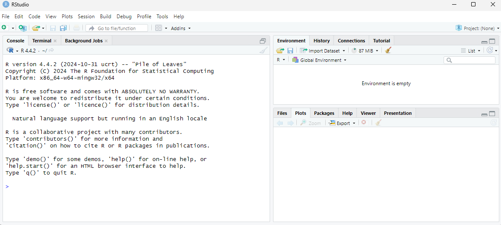
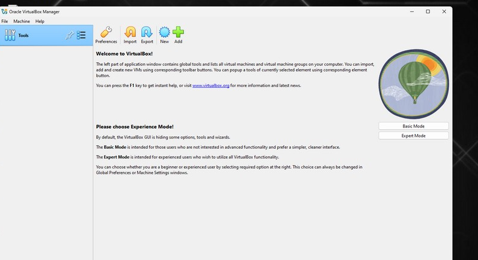
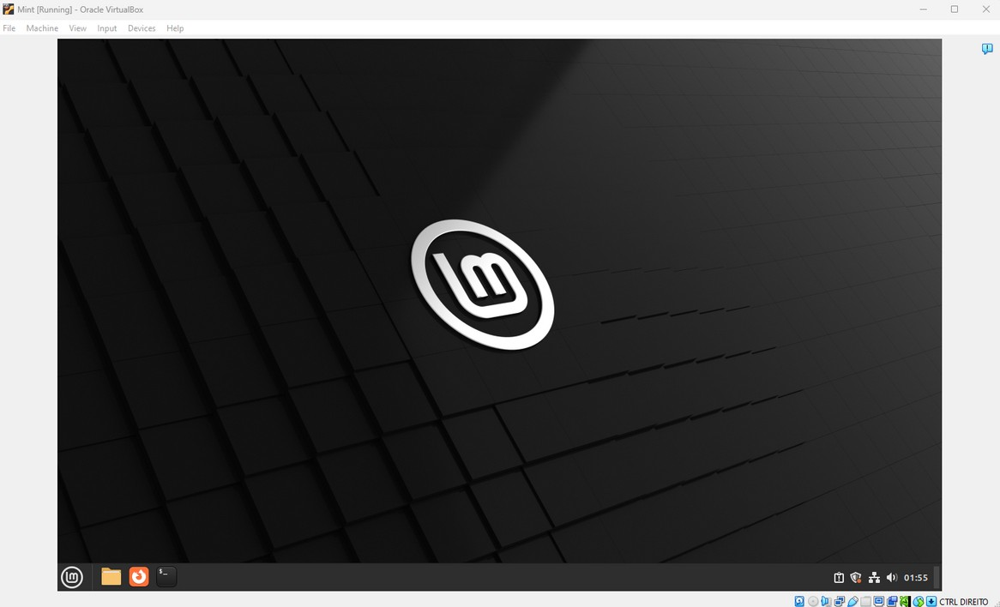
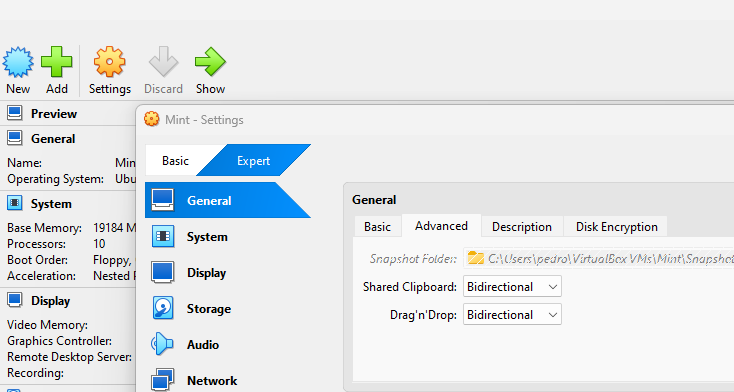

# Tutorial 1 — Setting the Stage

> *Advances in Microbial Genomics and Bioinformatics — Tutorials · by Pedro Santos*

This first tutorial sets up everything you need before the bioinformatics starts: the platform, and how to prepare your own machine (R/RStudio, a Linux environment, and a Miniconda installation).

---

## 1. Platform

- All tools have been implemented and extensively tested on **Linux (Ubuntu)**. Tips for working on **Windows/macOS** are provided where relevant.
- Getting comfortable with Linux (mostly Ubuntu-based) is advisable but **not mandatory** — these tutorials provide the hints you need to use it.

---

## 2. Compute resources & data

These tutorials are written to run on your own machine (see the hardware note in §4). If you have access to institutional **storage and processing servers**, how you reach them — credentials, VPN, file transfer (FileZilla), remote desktop (RDP/Remmina) — is specific to your institution and is not covered here.

The **datasets** are not bundled with these tutorials. They are archived on Zenodo:

<https://doi.org/10.5281/zenodo.20569025>

Each tutorial indicates which ZIP file to download.

---

## 3. Tools

Most bioinformatics tools are compatible with **UNIX-based systems** (<https://en.wikipedia.org/wiki/Unix>). There are ways to run them on Windows/macOS, but it can be troublesome. There are also many "flavors" of UNIX-based systems that are not fully/directly compatible (e.g. different versions, installed software, etc.).

One way around this is to use **closed and/or virtual environments** that bundle all the requirements (dependencies, software) needed to run specific tools.

Our workstations have some bioinformatics tools installed system-wide, but **we will mostly use closed environments based on Anaconda/Miniconda** (<https://anaconda.org/anaconda/conda>).

---

## 4. Setting up your own notebook/PC

> **Disclaimer — hardware.** Bioinformatics tools are often CPU- and RAM-hungry. Simple operations on small data are fine on a modest machine, but as data grows (e.g. genomic data is far more demanding than amplicon data) you may hit crashes, mostly from **lack of RAM**. Recommended minimums: **≥16 GB RAM** for "simple" operations and R analyses, **≥32 GB** for genomic data (8 GB will cap out quickly). You'll also need a fair amount of **SSD/HDD** space, since outputs fill disks fast. **Don't install the following tools if you have < 40 GB free**, and try to keep 100–200 GB free.

### 4.1 Install R and RStudio

Installing R and RStudio is straightforward on all OSes; there are many tutorials, e.g.:

- <https://teacherscollege.screenstepslive.com/a/1108074-install-r-and-rstudio-for-windows>
- <https://posit.co/download/rstudio-desktop/>

After installing, check that RStudio runs by opening it. You should see something like:



### 4.2 Install WSL (Windows Subsystem for Linux) — Windows 11

Since most PCs/notebooks ship with Windows, and most bioinformatics tools target UNIX, you should be able to reach a Linux distribution. Besides using the group servers, you can install a simple Ubuntu environment in Windows 11. Follow:

- <https://learn.microsoft.com/en-us/windows/wsl/install>
- <https://www.minitool.com/partition-disk/install-ubuntu-on-windows-11.html>

In a terminal:

```powershell
wsl --install
```

If all goes well, you'll see Virtual Machine Platform, WSL, and Ubuntu being installed (reboot when prompted).


Alternatively, you can create a virtual environment using **VirtualBox** or **VMware** with a Linux distribution (see below).

### 4.3 Prepare and run an Ubuntu-based VirtualBox — Windows 11

> *[only for Windows 11]*

Follow: <https://ubuntu.com/tutorials/how-to-run-ubuntu-desktop-on-a-virtual-machine-using-virtualbox#1-overview>

1. Download and install **VirtualBox**.
2. Download and install the **VirtualBox Extension Pack** (<https://www.lifewire.com/install-virtualbox-extension-pack-4782422>) — *versions may change over time.*
3. Download a Linux distribution: **Ubuntu** (<https://ubuntu.com/download/desktop>) or **Mint** (<https://linuxmint.com/>) — the author prefers Mint.
4. Install the distribution through VirtualBox. Also download **VBoxGuestAdditions** (<https://download.virtualbox.org/virtualbox/>) matching your VirtualBox version, and install it alongside the Linux distribution.

If everything went well, after rebooting the image you'll have a working Linux VM:




#### Prepare a shared folder (host ⇄ guest file transfer)

A permanently shared folder makes data/file transfer between host (your PC) and guest (the VM) easy.

**Step 1 — Install Guest Additions**
1. Start your VM.
2. With the guest running, click **Devices** in the VirtualBox toolbar.
3. Select **Insert Guest Additions CD image…**
4. Inside the guest, run the setup (it mounts as a virtual CD) and follow the on-screen instructions.

**Step 2 — Set up the shared folder**
1. Shut down the guest.
2. In VirtualBox Manager, select your VM → **Settings**.
3. Go to **Shared Folders**.
4. Click the **Add new shared folder** icon (folder with a `+`).
5. In **Folder Path**, choose the host folder to share (use **Other…** to browse).
6. In **Folder Name**, enter a name (it appears under that name in the guest).
7. Check **Auto-mount**.
8. Click **OK** twice.

**Step 3 — Access the shared folder in the guest**
With auto-mount enabled, the share usually appears under `/media/sf_<name>`. To get write permissions, add your user to the `vboxsf` group:

```bash
sudo adduser your_username vboxsf
```

Then log out and back in for the group change to take effect.

Finally, enable **shared clipboard** and **drag-and-drop** (within the shared folder) for productivity, via the VM **Settings** panel — the **bidirectional** option enables host ⇄ guest in both directions.



### 4.4 Prepare and run an Ubuntu-based VMware — Windows 11

> *[only for Windows 11]*

VMware Workstation, like VirtualBox, runs virtual images of many OSes. To learn more: <https://knowledge.broadcom.com/external/article/344595/downloading-and-installing-vmware-workst.html>

1. **Install VMware Workstation.** *(For personal use, state so during installation.)*
2. **Install the Linux distribution through VMware.** For Ubuntu it's straightforward: <https://medium.com/@florenceify74/how-to-download-install-and-run-ubuntu-in-vmware-workstation-ce5f2d4d0438>

To install Mint, the author followed: <https://mikewire.com/2023/08/25/installing-linux-mint-21-2-on-vmware/>

A Mac OS was even installed under VMware (for testing): <https://i12bretro.github.io/tutorials/0602.html>

> **Remarks.** A virtual machine (VirtualBox or VMware) gives you a full OS with all its advantages and caveats — a great way to meet a new OS. To get the most out of either, install the respective guest tools (VirtualBox Guest Additions or VMware Tools). Both systems have pros and cons; in the author's opinion VMware handles macOS better and overall performance is slightly better, while **file sharing is easier with VirtualBox**.

---

## 5. Prepare and test a Miniconda environment

In theory, Anaconda/Miniconda run under all OSes. In practice, most tools used in these tutorials **do not run well directly under Windows**. So if you are on Windows (e.g. Windows 11), it is much better to run them inside a **virtualization layer**: WSL, VirtualBox, or VMware. For macOS and Linux there are alternatives (e.g. Homebrew, or compilation), but given the variety of OSes and hardware, the easiest unified approach is **conda** (or Docker).

### 5.1 Install Miniconda in WSL or a VirtualBox/VMware Linux guest

In the WSL or VirtualBox/VMware guest terminal, type sequentially (press Enter after each line):

```bash
mkdir -p ~/miniconda3
wget https://repo.anaconda.com/miniconda/Miniconda3-latest-Linux-x86_64.sh -O ~/miniconda3/miniconda.sh
bash ~/miniconda3/miniconda.sh -b -u -p ~/miniconda3
rm ~/miniconda3/miniconda.sh
export PATH=~/miniconda3/bin:$PATH
conda init
conda config --set auto_activate_base false
```

> **Note:** the command above uses the `x86_64` installer (correct for nearly all VMs/WSL). If you run an ARM-based Linux (e.g. a Linux VM on an Apple-Silicon Mac), use the `…-Linux-aarch64.sh` installer instead.

**Check it works:** type `which conda` and/or `conda` in the terminal. You should see conda's help/output.


> **Tip:** `~` is your home directory. To jump back home from anywhere, run `cd ~` (`cd` = change directory).

### 5.2 Install Miniconda on macOS *(tested on Sonoma)*

**System preparation** (all in Terminal):

```bash
xcode-select --install          # install command line tools
/bin/bash -c "$(curl -fsSL https://raw.githubusercontent.com/Homebrew/install/HEAD/install.sh)"   # install Homebrew
```

> **VERY IMPORTANT — add Homebrew to your PATH.** Use the path that matches your Mac's architecture:
>
> **Apple Silicon (M1/M2/M3 — most modern Macs):**
> ```bash
> echo >> ~/.zprofile
> echo 'eval "$(/opt/homebrew/bin/brew shellenv)"' >> ~/.zprofile
> eval "$(/opt/homebrew/bin/brew shellenv)"
> ```
>
> **Intel Macs:**
> ```bash
> echo >> ~/.zprofile
> echo 'eval "$(/usr/local/bin/brew shellenv)"' >> ~/.zprofile
> eval "$(/usr/local/bin/brew shellenv)"
> ```
>
> *(The Homebrew installer prints the exact two `echo` lines for your machine at the end of its run — you can copy them from there.)*

About Homebrew: <https://brew.sh/>. The steps above keep `brew` and all installs at the **user level**.

```bash
brew install wget    # very useful for terminal-mediated downloads
brew install java    # key for many macOS operations, namely at the terminal level
```

> **Important — make the JDK usable.** For the system Java wrappers to find this JDK, symlink it (adjust `/usr/local` → `/opt/homebrew` on Apple Silicon):
> ```bash
> sudo ln -sfn /usr/local/opt/openjdk/libexec/openjdk.jdk /Library/Java/JavaVirtualMachines/openjdk.jdk
> ```
> To put openjdk first in your PATH:
> ```bash
> echo 'export PATH="/usr/local/opt/openjdk/bin:$PATH"' >> ~/.zshrc
> ```
> For compilers to find openjdk:
> ```bash
> export CPPFLAGS="-I/usr/local/opt/openjdk/include"
> ```
> *(These are printed during the Java install, but you need to apply them.)*

**Miniconda install (macOS):** use the installer matching your architecture.

```bash
# Apple Silicon:
wget https://repo.anaconda.com/miniconda/Miniconda3-latest-MacOSX-arm64.sh -O ~/miniconda.sh
# Intel:
# wget https://repo.anaconda.com/miniconda/Miniconda3-latest-MacOSX-x86_64.sh -O ~/miniconda.sh

bash ~/miniconda.sh -b -p $HOME/miniconda
export PATH="$HOME/miniconda/bin:$PATH"   # should also be added to ~/.zshrc (check it is)
conda init zsh
# close and reopen the terminal — you should see (base) in front of the path
conda deactivate
conda config --set auto_activate_base false
```

---

> ✅ **If everything went well, you're ready to start the bioinformatics tutorials. Congrats!**
