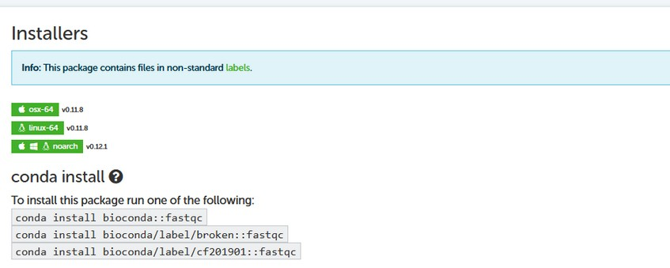
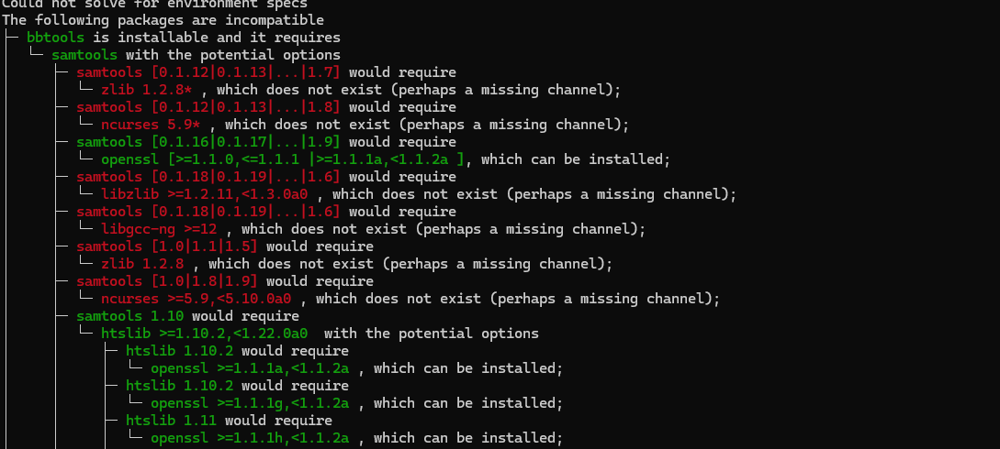
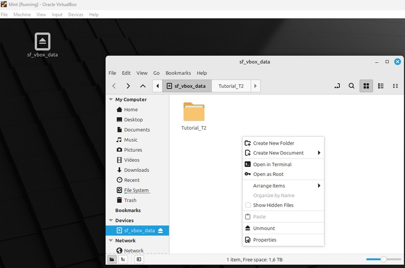
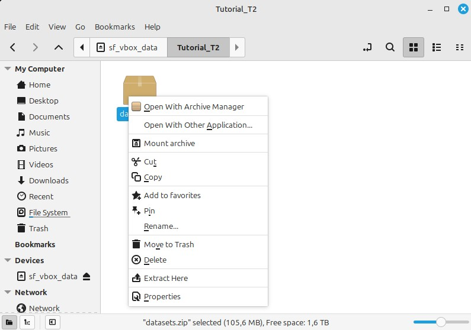
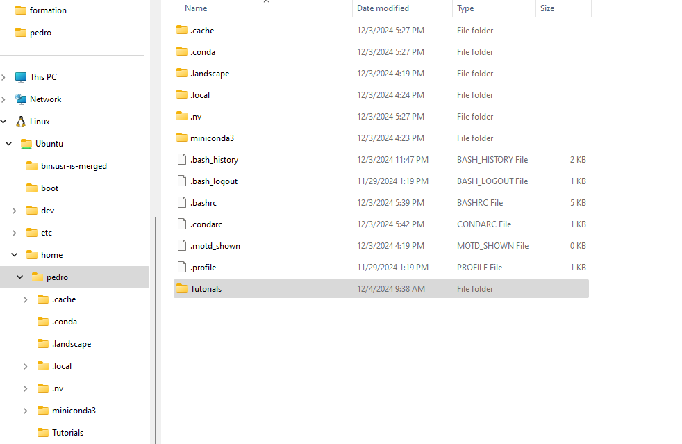
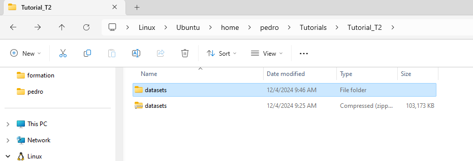
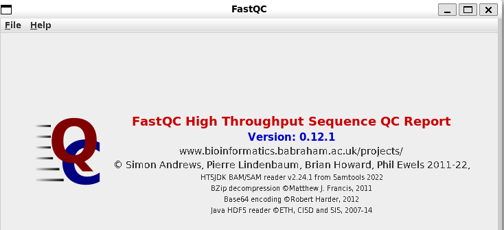
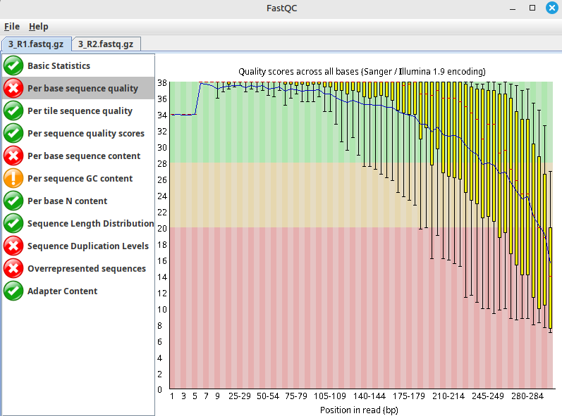
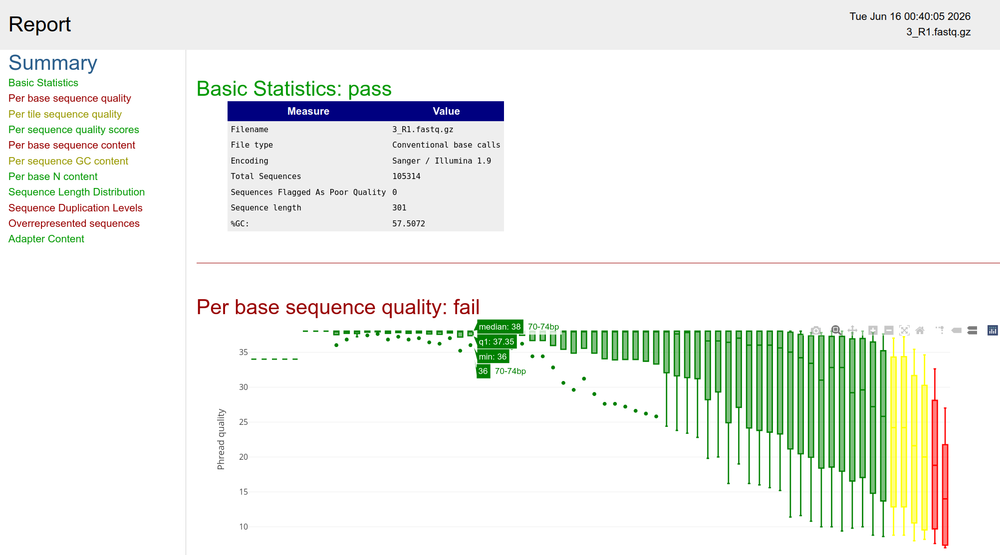
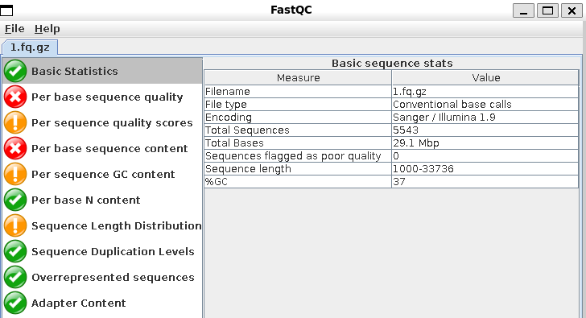

# Tutorial 2 — Somethings about Qualities

> *Advances in Microbial Genomics and Bioinformatics — Tutorials · by Pedro Santos*
>
> **Part I — Quality assessment & read filtering**

## Tools used

| Tool | Link |
|------|------|
| FastQC | <https://www.bioinformatics.babraham.ac.uk/projects/fastqc/> |
| falco *(GUI-free FastQC replacement)* | <https://github.com/smithlabcode/falco> |
| fastp | <https://github.com/OpenGene/fastp> |
| BBTools | <https://jgi.doe.gov/data-and-tools/software-tools/bbtools/> |
| Trimmomatic | <http://www.usadellab.org/cms/?page=trimmomatic> |
| FASTX-Toolkit | <https://github.com/agordon/fastx_toolkit> |
| Filtlong | <https://github.com/rrwick/Filtlong> |
| NanoFilt | <https://github.com/wdecoster/nanofilt> |

> **Note:** NanoFilt is being replaced by **Chopper** (<https://github.com/wdecoster/chopper>), but at the time of writing Chopper still has several implementation bugs.

> **Data.** Download `datasets_T2.zip` from the Zenodo record and place it in a working folder:
> <https://doi.org/10.5281/zenodo.20569025>

> **About this tutorial.** It includes `[Q#]` questions for discussion and self-assessment — answer them. When links are provided, use them to complement the text. This tutorial assumes you completed **Tutorial 1** and have a working Miniconda distribution.

---

## 1. Introduction

The output of a sequencing run (the sequencing **reads**) leads — directly or indirectly — to raw dataset files with extension `.fastq` / `.fq`. Take your time to read this primer on sequencing data:

<https://bioinformatics-core-shared-training.github.io/cruk-summer-school-2017/Day1/Session4-seqIntro.html>

This tutorial introduces tools to **assess the quality** (and other metrics) of your datasets and to **filter** reads (or parts of them) with low quality.

---

## 2. Installing the necessary tools

You'll build your first working environment under Miniconda. Many tools run inside a conda environment — to check whether a tool is available, search <https://anaconda.org/>. Searching for `fastqc`, for example, shows it is provided by the **bioconda** channel (most bioinformatics tools live there).



We'll need **FastQC, fastp, falco, BBTools, Trimmomatic** and **FASTX**. But first, create an environment.

> **Hint:** think of a conda environment as a closed system holding all the dependencies a tool needs. You activate/deactivate environments as required.

Create an environment named `T2`:

```bash
conda create -n T2          # "create" is self-explanatory; -n assigns a name (here, T2)
```


After confirming (`y`), you've made your first conda environment. Activate it:

```bash
conda activate T2           # (T2) now appears in front of the prompt — the env is active
conda list                  # list installed packages
```


No packages?! By default, creating a generic conda environment just installs Python (check with `python3 -V`). Now that you've learned to create one, delete it again:

```bash
conda deactivate
conda env remove -n T2
```

Now create the environments this tutorial needs — one named `reads` and one named `nano` — then activate `reads` and install the short-read tools:

=== "Linux / WSL"

    ```bash
    conda create -n reads
    conda activate reads
    conda install -c bioconda fastqc trimmomatic fastx_toolkit fastp
    ```

=== "macOS"

    On macOS, prefix the install with `CONDA_SUBDIR` matching your architecture (keep this in mind throughout the tutorials):

    ```bash
    conda create -n reads
    conda activate reads
    # Intel:
    CONDA_SUBDIR=osx-64    conda install -c bioconda fastqc trimmomatic fastx_toolkit fastp
    # Apple Silicon:
    CONDA_SUBDIR=osx-arm64 conda install -c bioconda fastqc trimmomatic fastx_toolkit fastp
    ```


Notice we did **not** install BBTools. If you try `conda install agbiome::bbtools`, you'll likely hit a dependency conflict:



This is because BBTools' dependencies differ from those of the other tools — you can't always host tools requiring incompatible dependency versions in the same environment. The most straightforward fix is a **dedicated environment**:

```bash
conda deactivate
conda create -n bbtools -c agbiome -c bioconda -c conda-forge bbtools
```

If that fails (the agbiome server is sometimes down), use:

```bash
conda create -n bbmap -c bioconda bbmap
```

> **Note:** `bbmap` is a subpackage of BBTools but contains all the tools we need for this tutorial.

We've now installed everything in **two** environments. But suppose we'd like them all in **one** — just to see whether it's possible. With no environment active, try:

```bash
conda create -n read_prep -c agbiome -c bioconda -c conda-forge bbtools fastqc trimmomatic fastx_toolkit fastp
```


It worked this time! Why did installing packages separately fail before, but installing them together succeeds now?

- When installing multiple packages at once, conda solves for a mutually **compatible** set of dependencies. Installing one at a time can leave earlier dependencies incompatible with later additions.
- The command above also adds the **conda-forge** channel, which provides many dependencies that aid compatibility.
- It's not always possible to combine packages in one environment — to avoid conflicts, separate environments are often advisable (as we did for BBTools).

Check your environments:

```bash
conda env list
```


Before using the tools, install **Filtlong** and **NanoFilt** in the `nano` environment. **Can you do it without further instructions? How?** `[Q1]`


> **Note:** keep these procedures in mind — they'll be handy in the next tutorials.

---

## 3. Preparing data for processing

Download `datasets_T2.zip` from the Zenodo record, create a folder named `datasets`, place the ZIP there, and extract it inside that folder.

### 3.1 VirtualBox
If you use VirtualBox with drag-and-drop enabled, create a folder under your shared folder and drag `datasets_T2.zip` into it. Right-click the file → **Extract Here**.




Remember the location — something like `/media/sf_vbox_data/Tutorial_T2/datasets`.

> **Note:** there are other ways to extract compressed files, but this is fine for now.

### 3.2 WSL
With a WSL install, you'll see a **Linux** icon in the File Explorer left pane:




- Expand it and create a folder called `Tutorials` under your username.
  > **Hint:** if you use a different name, adjust the rest of the tutorial accordingly — you must always know where your data lives.
- Inside `Tutorials`, create `Tutorial_T2/datasets`, drag `datasets_T2.zip` there, and extract it.



> **Tip:** you may get some warnings — you can safely ignore them.

---

## 4. Quality assessment

Start WSL (type `wsl` in a terminal) or your Linux VM. Then type:

```bash
fastqc
```

You'll probably see:


**Why?** `[Q2]`

> ⚠️ **Do NOT use `sudo apt install` for bioinformatics tools.** Many are available in the default Ubuntu repositories, but they're often **outdated** and — as stressed in Tutorial 1 — a system-wide install can cause incompatibilities and even system crashes. Use conda. (Once you're a Linux expert you can decide to install some things system-wide.)

Recall you prepared environments with FastQC. Activate one:

```bash
conda activate read_prep
fastqc
```

If FastQC throws a Java error like `java: symbol lookup error: ... undefined symbol: JLI_StringDup`, it's the dependency-mixing side effect mentioned earlier (the `read_prep` env mixed bioconda, conda-forge and agbiome, which carry different Java versions). Force a compatible Java:

```bash
conda install --force-reinstall java-jdk
```

> **Note:** in daily practice, fixes like this require some understanding of what's going on — i.e. experience. Alternatively, just use the `reads` environment, whose FastQC works cleanly because it only used the bioconda channel.

Either way, `fastqc` should now launch the GUI:



Use **File → Open** to navigate to the `datasets` folder. You should see **five** datasets:

| # | File(s) | Platform |
|---|---------|----------|
| 1 | `1.fq.gz` | Oxford Nanopore |
| 2 | `2.fastq.gz` | 454 Roche *(legacy platform, discontinued ~2016 — kept here for its distinct quality profile)* |
| 3 | `3_R1.fastq.gz` + `3_R2.fastq.gz` | Illumina (paired reads) |
| 4 | `4.fq.gz` | PacBio |

### A GUI-free alternative — falco

FastQC is a Java/Swing application. Launched with **no arguments** it opens a **graphical window**, which under **WSL** needs a working X server (WSLg). On many lab machines that window **hangs or crashes**. If that happens to you — or you simply prefer the command line — use **falco**.

falco is a C++ drop-in re-implementation of FastQC: **same modules, near-identical HTML report**, but no Java, no GUI, and much faster. MultiQC reads its output too.

falco wasn't in the environments we built in section 2, so create a small one for it. (fastp is already installed — in the `read_prep`/`reads` env — so we don't repeat it here.)

```bash
conda create -n qc -c bioconda -c conda-forge falco
conda activate qc
falco --version
```

Run it **headless** — one output folder per sample:

```bash
falco -o qc_raw_1     1.fq.gz
falco -o qc_raw_2     2.fastq.gz
falco -o qc_raw_3_R1  3_R1.fastq.gz
falco -o qc_raw_3_R2  3_R2.fastq.gz
falco -o qc_raw_4     4.fq.gz
```

Each folder gets the same trio FastQC produces — `fastqc_report.html` (open this), `fastqc_data.txt` (MultiQC reads it) and `summary.txt` (pass/warn/fail per module).

**Opening a report under WSL.** The most reliable, no-setup way is to hand the folder to Windows and double-click the HTML:

```bash
explorer.exe .        # opens this folder in Windows Explorer → open qc_raw_3_R1/fastqc_report.html
```

Alternatively, `wslview` opens it straight in your default browser — but it belongs to the **wslu** package, which isn't installed by default, so you'll be told to install it first:


```bash
sudo apt install wslu                    # see note below
wslview qc_raw_3_R1/fastqc_report.html
```

> Unlike the earlier warning against `sudo apt` for *bioinformatics* tools, `wslu` is a general **system utility** (not a bioinformatics package), so a system-wide install is appropriate here.

Whether you used the FastQC GUI or falco, inspect each file's report (`.gz` is fine; `fq` is just short for `fastq`). Use the **help menu** and the FastQC link above as your "friends" to interpret the output, and **save the reports** (the GUI's **Save report**, or simply keep falco's `qc_raw_*` folders) to avoid re-running a sample. **Register what you observe.**

For dataset 3 (paired reads), you should check the forward (R1) and reverse (R2) per-base quality (if working with Fastqc, if falco is being used a similar representation should be displayed (below)):




There are clear differences, mostly **above ~150 bp**, and near the read ends (**> ~220 bp** the overall quality drops into the red/poor zone — visibly worse for R2). These quality levels can compromise downstream analyses.

---

## 5. Read filtering (Roche & Illumina)

Open a terminal **inside the `datasets` folder**:

```bash
cd ~/Tutorials/Tutorial_T2/datasets
```

We'll filter datasets 2 and 3.

### BBDuk
With the `read_prep` (or `bbtools`/`bbmap`) environment active, check the tool is available:

```bash
bbduk.sh
```


Then filter (a minimum quality threshold of 28, trimming both ends):

```bash
# dataset 2 (single-end)
bbduk.sh in=2.fastq.gz out=2_clean.fq qtrim=rl trimq=28

# dataset 3 (paired-end)
bbduk.sh in=3_R1.fastq.gz in2=3_R2.fastq.gz out1=3_clean1.fq out2=3_clean2.fq qtrim=rl trimq=28
```

Re-assess the trimmed files with **falco** (activate the `qc` env again) — or the FastQC GUI — and compare with the raw reports from section 4:

```bash
conda activate qc
falco -o qc_bbduk_2     2_clean.fq
falco -o qc_bbduk_3_R1  3_clean1.fq
falco -o qc_bbduk_3_R2  3_clean2.fq
```

### fastp
fastp lives in the `read_prep`/`reads` env (not in `qc`), so switch back and check it's available (typing `fastp` then Enter prints its options):

```bash
conda activate read_prep
fastp
```

Then filter with the same Q value (28):

```bash
# dataset 2
fastp -i 2.fastq.gz -D -q 28 -o 2_fastp.fastq.gz -j 2_fastp.json -h 2_fastp.html

# dataset 3
fastp -i 3_R1.fastq.gz -I 3_R2.fastq.gz -D -q 28 \
      -o 3_R1_fastp.fastq.gz -O 3_R2_fastp.fastq.gz -j 3_fastp.json -h 3_fastp.html
```

fastp already writes its **own before/after report** (`2_fastp.html`, `3_fastp.html`) — open those first; they show read counts and per-base quality before vs after filtering in one page. Then, if you want a like-for-like comparison with the section-4 and BBDuk reports, re-assess the fastp outputs with falco (switch back to the `qc` env):

```bash
conda activate qc
falco -o qc_fastp_2     2_fastp.fastq.gz
falco -o qc_fastp_3_R1  3_R1_fastp.fastq.gz
falco -o qc_fastp_3_R2  3_R2_fastp.fastq.gz
```

Compare with the raw files **and** with the BBDuk results. **Are the results identical? Why?** `[Q3]`

Typing `bbduk.sh` or `fastp` shows there are many options for read filtering — test, for instance, the effect of the quality cutoff (`trimq=` / `-q`).

> **Auto-learning challenge 1.** The `read_prep` environment includes several filtering tools (we used only two). List them with `conda list -n read_prep`, then learn how to use **Trimmomatic** and **FASTX** and apply them to datasets 2 and 3.

---

## 6. Read filtering (Oxford Nanopore)

We'll use a small Nanopore dataset (`1.fq.gz`). Two useful pre-assembly filters:

- Filtlong — <https://github.com/rrwick/Filtlong>
- NanoFilt — <https://github.com/wdecoster/nanofilt>

> Check the links to understand what these tools do.

First, confirm access to the tools:

```bash
conda activate nano    # verify the env is active
filtlong -h            # OK?
NanoFilt -h            # OK?
```

If not, you probably still need to create that environment (see `[Q1]`).

Check the quality of the raw data with **falco** (env `qc`; or the FastQC GUI), then open the report as in section 4:

```bash
conda activate qc
falco -o qc_raw_1 1.fq.gz     # then open qc_raw_1/fastqc_report.html
```



`1.fq.gz` has 5 543 reads, lengths 1 000–33 736 bp, 37 % GC.

> **Hint:** you can also get stats with `nanoq` — *if it isn't installed, what should you do?* (it isn't in the `nano` env yet):
> ```bash
> conda activate nano
> nanoq -i 1.fq.gz -s -H
> ```

### Filtlong

```bash
# 1 — soft filter
filtlong --min_length 1000 --keep_percent 90 1.fq.gz | gzip > 1_filtlong_1.fastq.gz

# 2 — intermediate
filtlong --min_length 1000 --mean_q_weight 10 --keep_percent 80 1.fq.gz | gzip > 1_filtlong_2.fastq.gz

# 3 — hard
filtlong --min_length 3000 --mean_q_weight 25 --keep_percent 50 1.fq.gz | gzip > 1_filtlong_3.fastq.gz
```

> **Tip:** read carefully what `--min_length`, `--mean_q_weight` and `--keep_percent` do, so you can interpret the results.

### NanoFilt

```bash
# 1 — soft filter
gunzip -c 1.fq.gz | NanoFilt -l 1000 -q 10 | gzip > 1_nanofilt_1.fastq.gz

# 2 — intermediate
gunzip -c 1.fq.gz | NanoFilt -l 3000 -q 10 | gzip > 1_nanofilt_2.fastq.gz

# 3 — hard
gunzip -c 1.fq.gz | NanoFilt -l 3000 -q 25 | gzip > 1_nanofilt_3.fastq.gz
```

---

## 7. Read filtering using R *(optional — challenge yourself)*

R can also analyze, process and filter sequencing data. A great, comprehensive starting point is the **Computational Genomics with R** book:

<https://compgenomr.github.io/book/>

If you want to become a competent bioinformatics researcher, read it fully. After reading, you'll be comfortable with R basics, genomic intervals and overlaps, sequence analysis (GC content, motif/TF-binding searches), genomics visualization (heatmaps, meta-gene plots, tracks), supervised/unsupervised learning, and analysis of RNA-seq / ChIP-seq / BS-seq / multi-omics data.

For this tutorial, jump to its **section 7** (in particular 7.2 and 7.3).

> **Auto-learning 2.** This may feel demanding depending on your R background — take your time; later tutorials need you to be comfortable with R, and I can help.
>
> Use the link above to **assess quality and filter dataset #3** with the R tools **QuasR** and **ShortRead**.
>
> Hints:
> - Use RStudio for visualization (you have it from Tutorial 1).
> - Set your working directory to the folder holding `3_R1.fastq.gz` and `3_R2.fastq.gz`, e.g. `setwd("~/R_analysis")`.
> - R ships with no extra packages — install from **Bioconductor**. For QuasR (<https://bioconductor.org/packages/release/bioc/html/QuasR.html>):
>   ```r
>   if (!require("BiocManager", quietly = TRUE))
>       install.packages("BiocManager")
>   BiocManager::install("QuasR")
>   ```
> - You may get help from ChatGPT, Gemini, etc.
>
> **Provide your R code and results. Critically compare them with the outputs from section 5.** `[Q4]`

---

## Questions

1. What is the **maximum read length** among all four raw datasets? `[Q5]`
2. What is the **maximum number of reads** among all four raw datasets? `[Q6]`
3. Did you observe any improvement when dataset **#2** was filtered with BBDuk? And with fastp? Support your answer. `[Q7]`
4. Did you observe any improvement when dataset **#3** was filtered with BBDuk? And with fastp? Support your answer. `[Q8]`
5. Provide the commands you used for **Trimmomatic** and **FASTX**. Were they easy to use? Support your answer. `[Q9]`
6. Comparing all the tools for **Illumina/Roche** filtering, which was the best performer, in your opinion? Why? `[Q10]`
7. For **long-read** filtering, which was the best performer? Why? `[Q11]`
8. Although we have a **PacBio** dataset (#4), we didn't use it here. Why? *(Hint: recall the discussions.)* `[Q12]`

> **Note:** do **not** delete the generated datasets — they will be used in the next tutorials.
