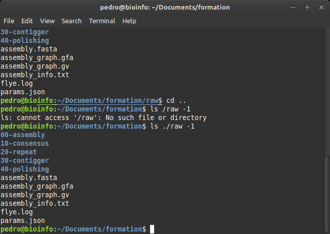
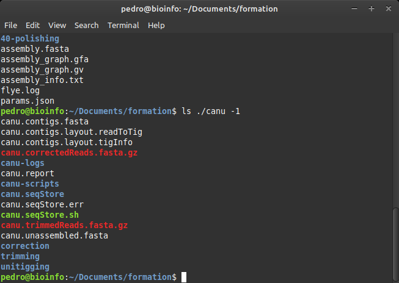
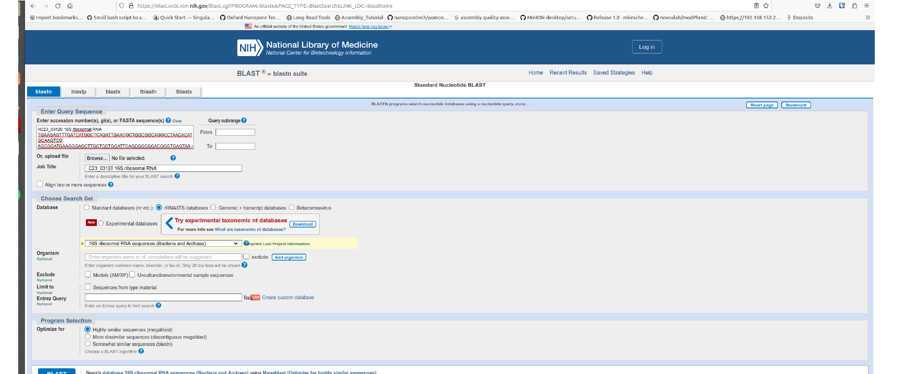
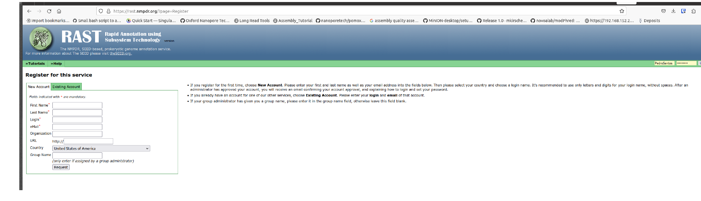

# Tutorial 3 — Somethings about Genome Assemblies

> *Advances in Microbial Genomics and Bioinformatics — Tutorials · by Pedro Santos*
>
> **Assembly & annotation**

## Tools used

| Tool | Link |
|------|------|
| Flye | <https://github.com/fenderglass/Flye> |
| Canu | <https://github.com/marbl/canu> |
| Racon | <https://github.com/isovic/racon> |
| Prokka | <https://github.com/tseemann/prokka> |
| RAST | <https://rast.nmpdr.org/> *(ideally register for an account)* |

> **About this tutorial.** It includes `[Q#]` questions to aid understanding of the concepts, approaches and challenges. Use the provided links to complement the text. Assumes you completed Tutorials 1–2.

---

## 1. Introduction

### Nanopore technology
For a brief overview: <https://nanoporetech.com/platform/technology>

**Data acquisition.** In nanopore sequencing, single-stranded nucleic acid molecules (DNA or RNA) translocate through a nanopore driven by an applied potential. A helicase ratchets the strand through the pore at ~450 bases/second. The strand passing through changes the ionic current — a continual change known as the **squiggle**. The MinKNOW software processes the squiggle into reads in real time, written out as **POD5** (or, in older runs, **FAST5**) files. This raw data carries information on canonical bases *and* base modifications (e.g. methylation).

### Basecalling
The ionic-current changes are interpreted into a base sequence by **basecalling**. The current production basecaller from Oxford Nanopore is **Dorado** (<https://github.com/nanoporetech/dorado>), which **replaced the older Guppy**. Basecalling can run during or after a run.

Models are pre-trained and chosen by a speed/accuracy trade-off:

- **fast** < **hac** (high accuracy) < **sup** (super-accurate) — accuracy increases, speed decreases.
- modification-aware models additionally detect base modifications (e.g. 5mC/5hmC).

Model names encode the chemistry, e.g. `dna_r10.4.1_e8.2_400bps_sup` (current **R10.4.1**). Older data used **R9.4.1** (`dna_r9.4.1_450bps_*`, flowcell FLO-MIN106) — now **legacy**.

Example (Dorado):

```bash
# basecalling (POD5 input) → BAM
dorado basecaller sup pod5_dir/ > calls.bam

# demultiplex by barcode kit
dorado demux --kit-name SQK-RBK004 --output-dir barcoded/ calls.bam
```

> **Legacy (Guppy).** Older pipelines used Guppy; for reference, the equivalent commands were:
> ```bash
> guppy_basecaller --disable_pings --compress_fastq -r -i fast5_dir -s $PWD/guppy_sup \
>   --cpu_threads_per_caller 20 --num_callers 1 -c dna_r9.4.1_450bps_hac.cfg -x "cuda:0"
> guppy_barcoder --compress_fastq -r -i $PWD/guppy_hac/pass -s $PWD/barcoded_guppy \
>   -t 8 -x "cuda:0" --barcode_kits "SQK-RBK004"
> ```
> (`-i` input dir, `-s` save dir, `-c` model/config, `-x` GPU mode.)

> Basecalling on CPU is **extremely slow** — an NVIDIA **GPU** (`cuda`) is normally used. It is the most time-consuming step. Reads classified as **fail** are normally discarded; **pass** reads are used downstream. Exact model names and flags depend on the Dorado/Guppy version and chemistry — check the Dorado repo.

---

## 2. Organize your data

This tutorial uses datasets **#1** (Nanopore) and **#4** (PacBio) from Tutorial 2. Create a working folder `Tutorial_T3` and copy these files into it:

```
1.fq.gz
1_filtlong_1.fastq.gz   1_filtlong_2.fastq.gz   1_filtlong_3.fastq.gz
1_nanofilt_1.fastq.gz   1_nanofilt_2.fastq.gz   1_nanofilt_3.fastq.gz
4.fq.gz
```

---

## 3. Assembly of nanopore data

Among many assemblers, these are usually the best performers:

- **Flye** — <https://github.com/fenderglass/Flye>
- **Canu** — <https://github.com/marbl/canu> *(a bit older)*

### 3.1 Assembling with Flye

```bash
conda create -n flye -c bioconda flye
conda activate flye
```

Generic usage: `flye --nano-raw reads.fastq.gz --threads <n> --out-dir <dir>`. For Nanopore, choose the input mode by read quality:

| Flag | When to use |
|------|-------------|
| `--nano-raw` | ONT regular reads, pre-Guppy5 (< 20 % error) |
| `--nano-corr` | ONT reads corrected by another method (< 3 % error) |
| `--nano-hq` | ONT high-quality: Guppy5+/Dorado **sup** or Q20 (< 5 % error) |

Other options: `-o/--out-dir`, `-t/--threads` (parallel threads), `-i/--iterations` (polishing iterations).

> **Note:** for data basecalled with modern high-accuracy models (Dorado/Guppy5+ **sup**, Q20+), `--nano-hq` is now the recommended mode over `--nano-raw`. We use `--nano-raw` below to match the older example data; try `--nano-hq` too and compare.

**3.1.1 — raw data** (run inside `Tutorial_T3`; check with `ls -1` that the datasets are present):

```bash
flye --nano-raw 1.fq.gz --threads 2 --out-dir raw
```

**3.1.2 — filtlong-filtered reads** (use the filtlong dataset that looked best in Tutorial 2):

```bash
flye --nano-raw 1_filtlong_1.fastq.gz --threads 2 --out-dir filtlong1
```

**3.1.3 — nanofilt-filtered reads**:

```bash
flye --nano-raw 1_nanofilt_1.fastq.gz --threads 2 --out-dir nanofilt1
```

> **Hints:** if in doubt, run all the filtered datasets (adjust `--out-dir` each time). `--threads 2` sets the number of cores — raise it to match your machine.

List a result folder:

```bash
ls ./raw -1
```



Decoding the outputs:

- `00-assembly`, `10-consensus`, `20-repeat`, `30-contigger`, `40-polishing` — folders with the stages of the assembly process.
- **`assembly.fasta`** — the main output: one or more contigs in FASTA. The sum of contigs gives an idea of the full genome length.
- `assembly_graph.gfa` / `.gv` — the assembly graph (open with [Bandage](https://github.com/rrwick/Bandage)).
- `assembly_info.txt` and `flye.log` — info on the process and outputs (number of contigs, total genome size, etc.).

---

## 4. Assembly with Canu

```bash
conda create -n canu -c conda-forge -c bioconda -c defaults canu
conda activate canu
```

Quick-start guide: <https://canu.readthedocs.io/en/latest/quick-start.html>

```bash
canu -p canu -d canu genomeSize=2.6m -nanopore 1.fq.gz \
     maxThreads=8 ovbMemory=10 ovsMemory=10 correctedErrorRate=0.10
```

> **Notes:** Canu doesn't need read pre-filtering (it has its own), though the authors recommend it. Adjust `maxThreads`/`*Memory` to your machine. Results go to the `canu` folder (`-d`).

```bash
ls ./canu -1
```



Files are prefixed `canu` (the `-p` option). Decoding:

- **`canu.contigs.fasta`** — the resulting contigs. The header is informative, e.g.:
  ```
  >tig00000001 len=644108 reads=1380 class=contig suggestRepeat=no suggestBubble=no suggestCircular=no trim=0-644108
  ```
  giving contig length, number of contributing reads, and whether it's circular (`suggestCircular`) — important when handling plasmids or aiming for closed prokaryotic genomes.
- `canu.report` — similar info to `flye.log`.
- `canu.trimmedReads.fasta.gz` — Canu first corrects and trims the raw reads (like Tutorial 2, but with its own tools), then assembles them.
- `canu.unassembled.fasta` — mostly singletons with issues (chimeras, bad ends) or collapsed repeats. This is normal — an assembly rarely uses the full read set.

> **Which seems the best assembly, and why?** To answer more objectively, use the metrics in the next section.

---

## 5. Assembly metrics — QUAST

QUAST (<https://quast.sourceforge.net/docs/manual.html>) assesses many aspects of assemblies. Install it in a conda env. At the end of installation it may print messages about optional extras (GRIDSS, SILVA 16S, BUSCO) and `quast-download-*` commands — don't worry, those are beyond this tutorial.

1. Create a folder `assemblies`.
2. Copy the contig files from the Flye/Canu runs into it, renamed clearly:
   ```
   raw.fasta        # assembly from raw reads
   filtlong.fasta   # assembly from filtlong-filtered reads
   nanofilt.fasta   # assembly from nanofilt-filtered reads
   canu.fasta       # assembly from Canu
   ```
3. Activate the env and check it works: `quast -h`.
4. Run (from inside `assemblies`):
   ```bash
   quast raw.fasta filtlong.fasta nanofilt.fasta canu.fasta -t 2 --glimmer --rna-finding -o $PWD/quast_output
   ```

> **Hint:** QUAST can also test read-mapping accuracy and conserved-gene integrity, but that's time-consuming for this purpose.

---

## 6. Assembly polishing — Racon

Many tools refine assemblies: Medaka\*\*, nanopolish\*\*, polca\*, Pilon\*, Homopolish\*\*\*, Racon. *(\* needs Illumina data; \*\* GPU; \*\*\* a large DB of similar genomes.)* We'll focus on **Racon**. *(We'll go deeper into polishing in a mini-project.)*

```bash
conda create -n racon -c bioconda racon minimap2
mkdir ./racon
cp ./assemblies/*.fasta ./racon          # raw.fasta filtlong.fasta nanofilt.fasta canu.fasta
```

Copy the filtered reads to polish with into `./racon`:

```
1_filtlong_1.fastq.gz
1_nanofilt_1.fastq.gz
canu.trimmedReads.fasta.gz
```

Polish (move into `./racon` and activate the env). Each round = map reads back (`minimap2`) then correct (`racon`):

```bash
# raw assembly, polished with filtlong-filtered reads
minimap2 -x map-ont raw.fasta 1_filtlong_1.fastq.gz > raw_filtlong.paf
racon 1_filtlong_1.fastq.gz raw_filtlong.paf raw.fasta > racon_raw1.fasta

# raw assembly, polished with nanofilt-filtered reads
minimap2 -x map-ont raw.fasta 1_nanofilt_1.fastq.gz > raw_nanofilt.paf
racon 1_nanofilt_1.fastq.gz raw_nanofilt.paf raw.fasta > racon_raw2.fasta

# raw assembly, polished with canu-trimmed reads
minimap2 -x map-ont raw.fasta canu.trimmedReads.fasta.gz > raw_canu.paf
racon canu.trimmedReads.fasta.gz raw_canu.paf raw.fasta > racon_raw3.fasta
```

Repeat (adjusting names) for the other assemblies (`filtlong.fasta`, `nanofilt.fasta`, `canu.fasta`) — in the end you'll have **12** polished assemblies.

> **Hint — multiple rounds.** You can polish repeatedly (not required here). Each round, feed the previous round's output back in:
> ```bash
> # round 1
> minimap2 -x map-ont raw.fasta canu.trimmedReads.fasta.gz > raw_canu1.paf
> racon canu.trimmedReads.fasta.gz raw_canu1.paf raw.fasta > racon_cons1.fasta
> # round 2
> minimap2 -x map-ont racon_cons1.fasta canu.trimmedReads.fasta.gz > raw_canu2.paf
> racon canu.trimmedReads.fasta.gz raw_canu2.paf racon_cons1.fasta > racon_cons2.fasta
> # round 3 …
> ```

Compare all 12 polished + 4 non-polished assemblies with QUAST (as in §5). **Which assembly seems better?** `[Q1]`

> **Remark:** polishing is more successful when read coverage is above a certain threshold. With the small datasets here, polishing outputs may be misleading.

---

## 7. Annotation

### 7.1 Prokka

```bash
conda create -n prokka -c conda-forge -c bioconda -c defaults prokka
mkdir ./prokka
cp assembly.fasta ./prokka      # use your best assembly (per the QUAST analysis)
cd ./prokka
conda activate prokka
prokka --compliant --outdir annotated --locustag C23 --prefix C23 --evalue 0.001 --addgenes assembly.fa
```

*(Adjust the input name — your best assembly may not literally be `assembly.fa`.)*

Check the outputs:

```bash
ls -a $PWD/annotated
# C23.err  C23.ffn  C23.fsa  C23.gff  C23.sqn  C23.tsv
# C23.faa  C23.fna  C23.gbk  C23.log  C23.tbl  C23.txt
```

| Ext | Description |
|-----|-------------|
| `.gff` | Master annotation (GFF3) — sequences + annotations; viewable in Artemis/IGV |
| `.gbk` | GenBank file derived from the master `.gff` |
| `.fna` | Nucleotide FASTA of the input contigs |
| `.faa` | Protein FASTA of translated CDS |
| `.ffn` | Nucleotide FASTA of all predicted transcripts (CDS, rRNA, tRNA, tmRNA, misc_RNA) |
| `.sqn` | ASN.1 "Sequin" file for GenBank submission |
| `.fsa` | Nucleotide FASTA of input contigs (used by `tbl2asn`) |
| `.tbl` | Feature table (used by `tbl2asn`) |
| `.err` | NCBI discrepancy report |
| `.log` | Full run log |
| `.txt` | Summary statistics of annotated features |
| `.tsv` | Tab-separated table of all features (locus_tag, ftype, len_bp, gene, EC_number, COG, product) |

### 7.2 Taxonomic lineage of the assembled organism

- Open `C23.ffn` with a text editor.
- Find the **16S rRNA** gene (there are usually several copies — you only need one) using the editor's *find*. You'll see something like:
  ```
  >C23_03120 16S ribosomal RNA
  TGAAGAGTTTGATCATGGCTCAGATTGAACGCTGGCGGCAGGCCTAACACATGCAAGTCG...
  ```
  *(The number in the header may differ — it's not relevant.)*
- Copy the header + sequence, go to <https://blast.ncbi.nlm.nih.gov/Blast.cgi>, and:



- Select **Nucleotide BLAST**.
- Paste the sequence into the query box.
- Under **Choose Search Set**, tick **rRNA/ITS** databases (16S ribosomal RNA sequences).
- Click **BLAST**.
- The highest-scoring hits indicate the **lineage of your strain** — note it; you'll use it in 7.3.

### 7.3 Annotate the assembly with RAST

- Go to <https://rast.nmpdr.org/> and register (or use a guest account).



- After login: **Your Jobs → Upload New Job**.
- Browse to your best assembly (`assembly.fa`); tick **use this data and go to step 2**.
- In **step 2**, fill the taxonomy **using the lineage you identified in 7.2** (the 16S BLAST result):
  ```
  Domain:        Bacteria
  Genus:         <the genus from your 7.2 BLAST result>
  species:       sp
  strain:        C23
  Genetic code:  11        # standard for most bacteria
  ```
- **use this data and go to step 3**.
- In **step 3**, tick: *Automatically fix errors*, *Build metabolic model*, *Disable replication*.
- **Finish the upload**, then go to **Jobs Overview** and wait until it finishes.

> **Note.** For this dataset, the 16S BLAST in 7.2 resolves to a **\*Staphylococcus\*** — so the genus above is *Staphylococcus*. (The original tutorial then compared against *Pseudomonas aeruginosa* PAO1 in 7.3.1, which is a different phylum and biologically inappropriate; that has been corrected below to a *Staphylococcus* reference.) Always fill the RAST taxonomy and choose comparison organisms based on **your own 16S result**.

> **Hint:** on WSL, copy `assembly.fa` to an easily browsable location (Desktop/Documents) before uploading.

#### 7.3.1 Compare "our" genome with a reference

- In RAST, **Jobs Overview → View Details** (under *Annotation progress*); you can download the annotated files and explore the genome features.
- Click **Browse annotated genome in SEED Viewer**; a window summarizes the classified features (interactive pie + legend).
- Under **Comparative Tools → Sequence based comparison**:
  - **1. Select Reference organism:** your annotated assembly.
  - **2. Select comparison organisms:** a close relative of your organism. For this dataset (a *Staphylococcus*), choose a **\*Staphylococcus\* reference genome** — e.g. *Staphylococcus aureus* (such as `Staphylococcus aureus subsp. aureus N315`), or the *Staphylococcus* species closest to your 7.2 BLAST result, from RAST's organism list.
  - **Compute** (don't refresh until done).
- You'll get a gene-by-gene comparison table (colour-coded by similarity) and, via **BlastDotPlot**, a dot-plot of similarity and orientation.

> **Tip:** you can compare against up to 4 organisms; we use one here.

#### 7.3.2 Explore other RAST tools

Under **Comparative Tools → KEGG metabolic analysis**, explore the metabolic network of your genome.

> **Note:** RAST has much more to offer — explore the dropdown menus (useful for the mini-project): genome content for a gene/protein family, closest genes from other organisms, closest organisms taxonomically.

---

## 8. Grand Challenge I

So far we used Nanopore data to reconstruct and annotate a genome. We also have a **PacBio** dataset (`4.fq.gz`). **Challenge:** adapt all the code and procedures to process, assemble and annotate the genome in that dataset, then answer the questions below.

## 9. Grand Challenge II *(optional)*

More advanced — most prerequisites must be built from scratch and you're pointed toward understanding the caveats and challenges of *de novo* assembly.

**Challenge:** obtain a genome assembly using **TryCycler** (<https://github.com/rrwick/Trycycler/wiki>) with no further instructions beyond the wiki and its links — use dataset `1.fq.gz` as the starting point. You'll need to install several tools and use them to accomplish this; the wiki is quite explanatory. Compare the result with your elected assembly and comment. `[Q2]`

> **Tips:** remember the install philosophy from earlier tutorials (**do NOT install anything with `sudo`**). Some previous results may be reusable if you understand the TryCycler approach.

---

## Questions

1. Among all the assemblies performed, which seems to be the best? Support your answer. `[Q3]`
2. How many **CDS** were found/annotated by **Prokka**? And by **RAST**? Can you envisage a hypothesis for the difference? `[Q4]`
3. What about the number of copies of the **tRNAs**? How many did each annotation tool find? Does it make sense (comparing both tools)? `[Q5]`
4. What about the number of copies of the **16S rRNA**? How many did each annotation tool find? Does it make sense (taking into account Q4 and Q5)? `[Q6]`
5. Considering the overall results, what could help **fine-tune the assembly**? Support your answer. `[Q7]`
6. For the **PacBio challenge** (§8), which difficulties did you face? Were the results identical, worse, or better than with `1.fq.gz`? Support your answer. `[Q8]`

> **That's all!**
